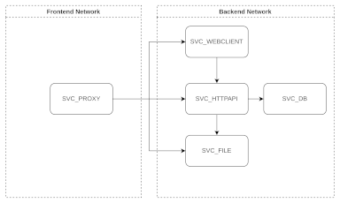

# Web Service on Docker

## Structure

### Nodes

| Service ID | Desc | Network |
| --- | --- | --- |
| SVC_DB | Database Service | internal |
| SVC_HTTPAPI | HTTP API Service | internal |
| SVC_WEBCLIENT | Web Client Side Service | internal |
| SVC_STORAGE | File Storage Service | internal |
| SVC_PROXY | Proxy Service | external |

## Stacks

### SVC_DB

- MySQL

### SVC_HTTPAPI

- Strapi
- NestJS

### SVC_WEBCLIENT

- NextJS

### SVC_PROXY

- NginX

### SVC_STORAGE

- Disk volume

## Networks

### `internalnet`(default, internal network)

- subnet: 10.0.0.0/24
- gateway: 10.0.0.1
- SVC_HTTPAPI: 10.0.0.1X
- SVC_DB: 10.0.0.2X
- SVC_WEBCLIENT: 10.0.0.31

### `externalnet`(default, external network)

- subnet: 10.1.1.0/24
- gateway: 10.1.1.1
